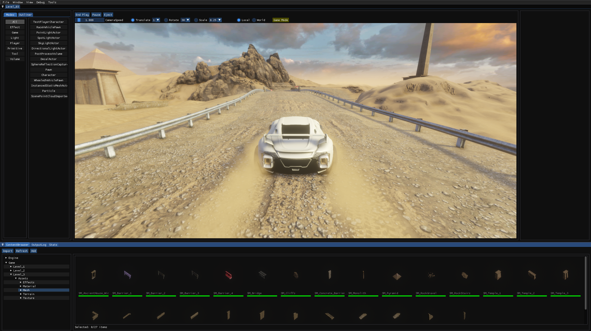
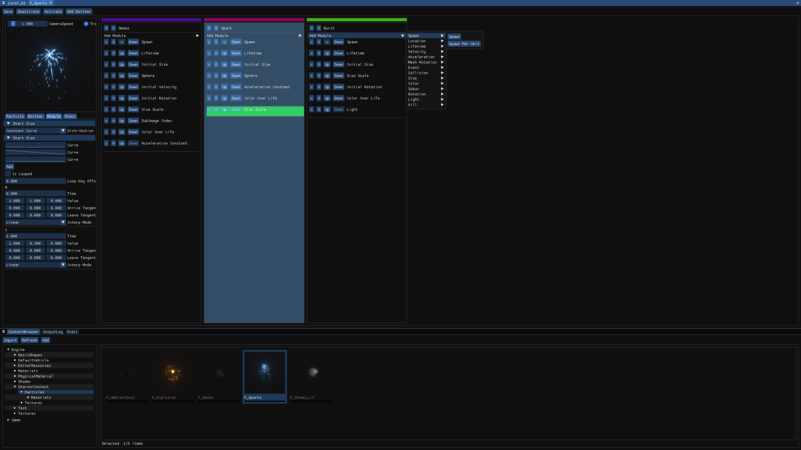
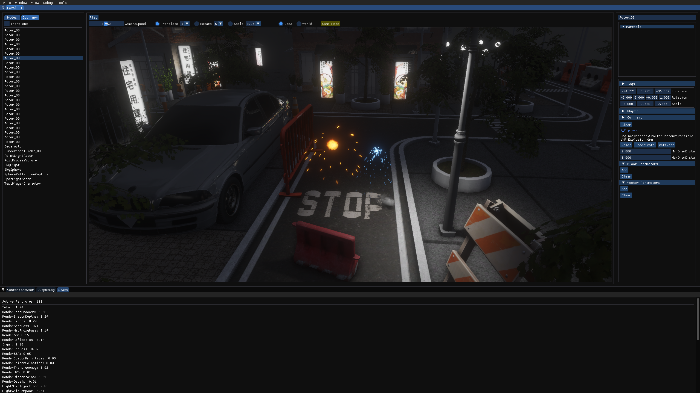
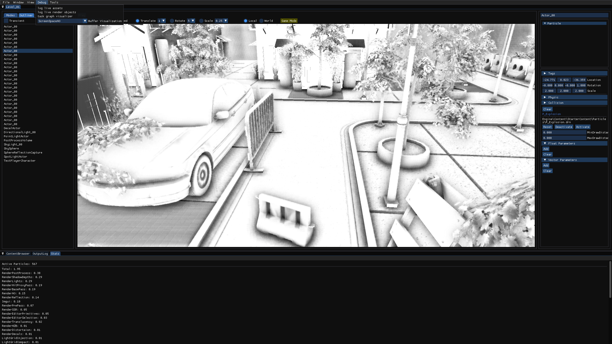

# DrnEngine

DrnEngine is a game engine under development for personal educational purposes.

## Features

- Bindless DX12 renderer
- Deferred opaque pass and separate translucent forward pass with light grid injection
- Directional light with cascade shadow mapping
- Point light and spot light with baked shadow mapping
- Image based lighting
- Reflection probs
- Deferred decals
- Post processing(SSAO, SSR, Bloom, TAA)
- Modular particle system
- Nvidia physx integration(rigid body and vehicle simulation and scene queries)

## Screenshots

|:------------------------------------------------------------:|:-------------------------------------------:|
|  |  |

|:-------------------------------------------------------:|:---------------------------------------------:|
|  |  |
